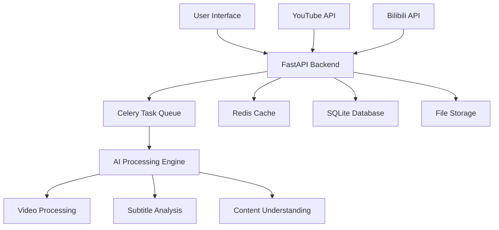

# AutoClip - AI-Powered Intelligent Video Clipping System


## AI-Based Intelligent Video Clipping and Processing System

Supports YouTube/Bilibili video downloading, automatic clipping, and intelligent collection generation

[](https://python.org)
[](https://reactjs.org)
[](https://fastapi.tiangolo.com)
[](https://www.typescriptlang.org)
[](https://celeryproject.org)
[](LICENSE)

[](https://github.com/zhouxiaoka/autoclip)
[](https://github.com/zhouxiaoka/autoclip)
[](https://github.com/zhouxiaoka/autoclip/issues)

**Language**: [English](README.md) | [中文](README-CN.md)  
**Contact**: [christine_zhouye@163.com](mailto:christine_zhouye@163.com)

</div>

## 🎯 Project Overview

AutoClip is an AI-powered intelligent video clipping system that can automatically download videos from YouTube, Bilibili, and other platforms, extract highlight segments through AI analysis, and intelligently generate collections. The system uses a modern separated frontend/backend architecture, providing an intuitive web interface and powerful backend processing capabilities.

**Contact**: [christine_zhouye@163.com](mailto:christine_zhouye@163.com)

### ✨ Core Features

- 🎬 **Multi-platform Support**: One-click download from YouTube and Bilibili, supports local file uploads
- 🤖 **AI-Powered Analysis**: Video content understanding based on Qwen large language model
- ✂️ **Auto Clipping**: Intelligently identifies highlight segments and auto-cuts, supports multiple video categories
- 📚 **Smart Collections**: AI-recommended and manually created video collections with drag-and-drop sorting
- 🚀 **Real-time Processing**: Async task queue, real-time progress feedback, WebSocket communication
- 🎨 **Modern Interface**: React + TypeScript + Ant Design, responsive design
- 📱 **Mobile Support** [In Development]: Responsive design, mobile experience being improved
- 🔐 **Account Management** [In Development]: Supports multiple Bilibili account management with automatic health checks
- 📊 **Data Statistics**: Complete project management and data statistics features
- 🛠️ **Easy Deployment**: One-click startup scripts, Docker support, detailed documentation
- 📤 **Bilibili Upload** [In Development]: Auto-upload clipped videos to Bilibili
- ✏️ **Subtitle Editing** [In Development]: Visual subtitle editing and synchronization

## 🏗️ System Architecture



### Tech Stack

#### Backend Technologies

- **FastAPI**: Modern Python web framework with automatic API documentation generation
- **Celery**: Distributed task queue supporting async processing
- **Redis**: Message broker and cache, task status management
- **SQLite**: Lightweight database, upgradeable to PostgreSQL
- **yt-dlp**: YouTube video downloader supporting multiple formats
- **Qwen (Tongyi Qianwen)**: AI content analysis, supports multiple models
- **WebSocket**: Real-time communication, progress push
- **Pydantic**: Data validation and serialization

#### Frontend Technologies

- **React 18**: UI framework with Hooks and function components
- **TypeScript**: Type safety for better development experience
- **Ant Design**: Enterprise-grade UI component library
- **Vite**: Fast build tool with hot reload
- **Zustand**: Lightweight state management
- **React Router**: Route management
- **Axios**: HTTP client
- **React Player**: Video player

## 🚀 Quick Start

### Requirements

#### Docker Deployment (Recommended)

- **Docker**: 20.10+
- **Docker Compose**: 2.0+
- **Memory**: Minimum 4GB, recommended 8GB+
- **Storage**: Minimum 10GB available space

#### Local Deployment

- **OS**: macOS / Linux / Windows (WSL)
- **Python**: 3.8+ (recommended 3.9+)
- **Node.js**: 16+ (recommended 18+)
- **Redis**: 6.0+ (recommended 7.0+)
- **FFmpeg**: Video processing dependency
- **Memory**: Minimum 4GB, recommended 8GB+
- **Storage**: Minimum 10GB available space

### One-Click Launch

#### Option 1: Docker Deployment (Recommended)

```bash
# Clone the project
git clone https://github.com/zhouxiaoka/autoclip.git
cd autoclip

# One-click Docker launch
./docker-start.sh

# Start in development mode
./docker-start.sh dev

# Stop services
./docker-stop.sh

# Check service status
./docker-status.sh
```

#### Option 2: Local Deployment

```bash
# Clone the project
git clone https://github.com/zhouxiaoka/autoclip.git
cd autoclip

# One-click launch (recommended, includes full checks and monitoring)
./start_autoclip.sh

# Quick start (development environment, skips detailed checks)
./quick_start.sh

# Check system status
./status_autoclip.sh

# Stop the system
./stop_autoclip.sh
```

### Manual Installation

```bash
# 1. Create virtual environment
python3 -m venv venv
source venv/bin/activate  # Linux/macOS
# or venv\Scripts\activate  # Windows

# 2. Install Python dependencies
pip install -r requirements.txt

# 3. Install frontend dependencies
cd frontend && npm install && cd ..

# 4. Install Redis
# macOS
brew install redis
brew services start redis

# Ubuntu/Debian
sudo apt update
sudo apt install redis-server
sudo systemctl start redis-server

# CentOS/RHEL
sudo yum install redis
sudo systemctl start redis

# 5. Install FFmpeg
# macOS
brew install ffmpeg

# Ubuntu/Debian
sudo apt install ffmpeg

# CentOS/RHEL
sudo yum install ffmpeg

# 6. Configure environment variables
cp env.example .env
# Edit the .env file and fill in API keys and other configuration
```

## 🎬 Feature Demo

### Main Features

1. **Video Download & Processing**
   - Supports YouTube and Bilibili video URL parsing
   - Automatically downloads video and subtitle files
   - Supports local file uploads

2. **AI-Powered Analysis**
   - Automatically extracts video outlines
   - Intelligently identifies topic timestamps
   - Scores segments for highlight quality

3. **Video Clipping & Collections**
   - Automatically generates highlight clips
   - AI-recommended collection combinations
   - Supports manual editing and sorting

4. **Real-time Progress Monitoring**
   - WebSocket real-time progress push
   - Detailed task status display
   - Error handling and retry mechanisms

5. **Bilibili Upload** [In Development]
   - Auto-upload clipped videos to Bilibili
   - Supports multiple account management
   - Batch upload and queue management

6. **Subtitle Editing** [In Development]
   - Visual subtitle editor
   - Subtitle sync and adjustment
   - Multi-language subtitle support

## 📖 Usage Guide

### 1. Video Download

#### YouTube Videos

1. Click "New Project" on the home page
2. Select "YouTube Link"
3. Paste the video URL
4. Select browser cookies (optional)
5. Click "Start Download"

#### Bilibili Videos

1. Click "New Project" on the home page
2. Select "Bilibili Link"
3. Paste the video URL
4. Select login account
5. Click "Start Download"

#### Local Files

1. Click "New Project" on the home page
2. Select "File Upload"
3. Drag and drop or select a video file
4. Upload subtitle file (optional)
5. Click "Start Processing"

### 2. Intelligent Processing

The system automatically performs the following steps:

1. **Material Preparation**: Download video and subtitle files
2. **Content Analysis**: AI extracts video outline and key information
3. **Timeline Extraction**: Identify topic time ranges
4. **Highlight Scoring**: AI scores each segment
5. **Title Generation**: Generate engaging titles for highlight segments
6. **Collection Recommendation**: AI recommends video collections
7. **Video Generation**: Generate clipped videos and collection videos

### 3. Result Management

- **View Clips**: See all generated video clips on the project detail page
- **Edit Info**: Modify clip titles, descriptions, and other information
- **Create Collections**: Manually create or use AI-recommended collections
- **Download & Export**: Download individual clips or complete collections
- **Bilibili Upload** [In Development]: One-click upload of clips to Bilibili
- **Subtitle Editing** [In Development]: Visually edit and sync subtitle files

## 🔧 Configuration

### Environment Variables

Create a `.env` file:

```bash
# Database configuration
DATABASE_URL=sqlite:///./data/autoclip.db

# Redis configuration
REDIS_URL=redis://localhost:6379/0

# AI API configuration
API_DASHSCOPE_API_KEY=your_dashscope_api_key
API_MODEL_NAME=qwen-plus

# Logging configuration
LOG_LEVEL=INFO
ENVIRONMENT=development
DEBUG=true

# File storage
UPLOAD_DIR=./data/uploads
PROJECT_DIR=./data/projects
```

### Bilibili Account Configuration [In Development]

1. Click "Bilibili Account Management" in the settings page
2. Select login method:
   - **Cookie Import** (recommended): Export cookies from browser
   - **Username & Password**: Enter credentials directly
   - **QR Code Login**: Scan QR code to log in
3. Once added, the system will automatically manage account health status

## 📁 Project Structure

```text
autoclip/
├── backend/                 # Backend code
│   ├── api/                # API routes
│   │   ├── v1/            # API v1
│   │   │   ├── youtube.py # YouTube download API
│   │   │   ├── bilibili.py # Bilibili download API
│   │   │   ├── projects.py # Project management API
│   │   │   ├── clips.py   # Video clip API
│   │   │   ├── collections.py # Collection management API
│   │   │   └── settings.py # System settings API
│   │   └── upload_queue.py # Upload queue management
│   ├── core/              # Core configuration
│   │   ├── database.py    # Database configuration
│   │   ├── celery_app.py  # Celery configuration
│   │   ├── config.py      # System configuration
│   │   └── llm_manager.py # AI model management
│   ├── models/            # Data models
│   │   ├── project.py     # Project model
│   │   ├── clip.py        # Clip model
│   │   ├── collection.py  # Collection model
│   │   └── bilibili.py    # Bilibili account model
│   ├── services/          # Business logic
│   │   ├── video_service.py # Video processing service
│   │   ├── ai_service.py  # AI analysis service
│   │   └── upload_service.py # Upload service
│   ├── tasks/             # Celery tasks
│   │   ├── processing.py  # Processing tasks
│   │   ├── upload.py      # Upload tasks
│   │   └── maintenance.py # Maintenance tasks
│   ├── pipeline/          # Processing pipeline
│   │   ├── step1_outline.py # Outline extraction
│   │   ├── step2_timeline.py # Timeline analysis
│   │   ├── step3_scoring.py # Highlight scoring
│   │   └── step6_video.py # Video generation
│   └── utils/             # Utility functions
├── frontend/              # Frontend code
│   ├── src/
│   │   ├── components/    # React components
│   │   │   ├── UploadModal.tsx # Upload modal
│   │   │   ├── ClipCard.tsx # Clip card
│   │   │   ├── CollectionCard.tsx # Collection card
│   │   │   └── BilibiliManager.tsx # Bilibili manager
│   │   ├── pages/         # Page components
│   │   │   ├── HomePage.tsx # Home page
│   │   │   ├── ProjectDetailPage.tsx # Project detail
│   │   │   └── SettingsPage.tsx # Settings page
│   │   ├── services/      # API services
│   │   │   └── api.ts     # API client
│   │   └── stores/        # State management
│   └── package.json
├── data/                  # Data storage
│   ├── projects/          # Project data
│   ├── uploads/           # Uploaded files
│   ├── temp/              # Temporary files
│   ├── output/            # Output files
│   └── autoclip.db        # Database file
├── scripts/               # Utility scripts
│   ├── start_autoclip.sh  # Start script
│   ├── stop_autoclip.sh   # Stop script
│   └── status_autoclip.sh # Status check
├── docs/                  # Documentation
│   ├── README.md          # Documentation center
│   ├── i18n.md           # Internationalization config
│   └── *.md              # Other docs
├── logs/                  # Log files
├── Dockerfile             # Docker image build file
├── Dockerfile.dev         # Development Docker file
├── docker-compose.yml     # Production Docker Compose
├── docker-compose.dev.yml # Development Docker Compose
├── docker-start.sh        # Docker start script
├── docker-stop.sh         # Docker stop script
├── docker-status.sh       # Docker status check script
├── .dockerignore          # Docker ignore file
├── DOCKER.md              # Docker deployment docs
└── *.sh                   # Startup scripts
```

## 🌐 API Documentation

After starting the system, access API documentation at:

- **Swagger UI**: [http://localhost:8000/docs](http://localhost:8000/docs) (local development)
- **ReDoc**: [http://localhost:8000/redoc](http://localhost:8000/redoc) (local development)

### Main API Endpoints

| Endpoint | Method | Description |
|----------|--------|-------------|
| `/api/v1/projects` | GET | Get project list |
| `/api/v1/projects` | POST | Create new project |
| `/api/v1/projects/{id}` | GET | Get project details |
| `/api/v1/youtube/parse` | POST | Parse YouTube video info |
| `/api/v1/youtube/download` | POST | Download YouTube video |
| `/api/v1/bilibili/download` | POST | Download Bilibili video |
| `/api/v1/projects/{id}/process` | POST | Start processing project |
| `/api/v1/projects/{id}/status` | GET | Get processing status |

## 🔍 Troubleshooting

### Common Issues

#### 1. Port Already in Use

```bash
# Check port usage
lsof -i :8000  # Backend port
lsof -i :3000  # Frontend port

# Kill the process
kill -9 <PID>
```

#### 2. Redis Connection Failed

```bash
# Check Redis status
redis-cli ping

# Start Redis service
brew services start redis  # macOS
systemctl start redis      # Linux
```

#### 3. YouTube Download Failed

- Check network connection
- Update yt-dlp: `pip install --upgrade yt-dlp`
- Try using browser cookies
- Check if the video is available

#### 4. Bilibili Download Failed

- Check account login status
- Update account cookies
- Check video permission settings

### Viewing Logs

```bash
# View all logs
tail -f logs/*.log

# View logs for a specific service
tail -f logs/backend.log    # Backend logs
tail -f logs/frontend.log   # Frontend logs
tail -f logs/celery.log     # Task queue logs
```

### System Status Check

```bash
# Detailed status check
./status_autoclip.sh

# Manually check services
curl http://localhost:8000/api/v1/health/  # Backend health check
curl http://localhost:3000/                # Frontend access test
redis-cli ping                             # Redis connection test
```

## 🛠️ Development Guide

### Backend Development

```bash
# Activate virtual environment
source venv/bin/activate

# Set Python path
export PYTHONPATH="${PWD}:${PYTHONPATH}"

# Start backend development server
python -m uvicorn backend.main:app --reload --port 8000
```

### Frontend Development

```bash
# Navigate to frontend directory
cd frontend

# Start development server
npm run dev
```

### Celery Worker

```bash
# Start Worker
celery -A backend.core.celery_app worker --loglevel=info

# Start Beat scheduler
celery -A backend.core.celery_app beat --loglevel=info

# Start Flower monitoring
celery -A backend.core.celery_app flower --port=5555
```

## 📊 Performance Optimization

### Production Configuration

1. **Database optimization**
   - Use PostgreSQL instead of SQLite
   - Configure connection pooling
   - Enable query caching

2. **Redis optimization**
   - Configure memory limits
   - Enable persistence
   - Set expiration policies

3. **Celery optimization**
   - Adjust concurrency
   - Configure task routing
   - Enable result backend

## 🔒 Security Configuration

### Production Security

1. **Environment variables**
   - Use strong passwords
   - Rotate keys regularly
   - Restrict API access

2. **Network security**
   - Configure firewall
   - Use HTTPS
   - Restrict CORS

3. **Data security**
   - Regular backups
   - Encrypt sensitive data
   - Access control

## 🚀 Deployment Guide

### Docker Deployment

#### Quick Start

```bash
# Clone the project
git clone https://github.com/zhouxiaoka/autoclip.git
cd autoclip

# Configure environment variables
cp env.example .env
# Edit the .env file and fill in the required configuration

# Start all services
docker-compose up -d

# Check service status
docker-compose ps
```

#### Accessing Services

- **Frontend UI**: [http://localhost:3000](http://localhost:3000) (local development)
- **Backend API**: [http://localhost:8000](http://localhost:8000) (local development)
- **API Docs**: [http://localhost:8000/docs](http://localhost:8000/docs) (local development)
- **Flower Monitoring**: [http://localhost:5555](http://localhost:5555) (local development)

#### Development Environment

```bash
# Use development environment configuration
docker-compose -f docker-compose.dev.yml up -d

# View logs in real time
docker-compose -f docker-compose.dev.yml logs -f
```

#### Full Instructions

For a complete Docker deployment guide, refer to the [DOCKER.md](DOCKER.md) documentation.

### System Service

```bash
# Create systemd service file
sudo nano /etc/systemd/system/autoclip.service

[Unit]
Description=AutoClip Video Processing System
After=network.target redis.service

[Service]
Type=forking
User=autoclip
WorkingDirectory=/opt/autoclip
ExecStart=/opt/autoclip/start_autoclip.sh
ExecStop=/opt/autoclip/stop_autoclip.sh
Restart=always

[Install]
WantedBy=multi-user.target
```

## 📈 Roadmap

### Coming Soon

- [ ] **Bilibili Upload**: Auto-upload clipped videos to Bilibili with multi-account management
- [ ] **Subtitle Editing**: Visual subtitle editor and sync feature
- [ ] **Multi-language Support**: Video processing support for more languages
- [ ] **Cloud Storage**: Integrate cloud storage services
- [ ] **Batch Processing**: Support batch video processing
- [ ] **Open API**: Provide a public API interface
- [ ] **Mobile App**: Develop a mobile application

### Long-term Plans

- [ ] **AI Model Optimization**: Integrate more AI models
- [ ] **Real-time Collaboration**: Support multi-user collaboration
- [ ] **Plugin System**: Support third-party plugins
- [ ] **Enterprise Edition**: Enterprise-grade features and services

## 🤝 Contributing

We welcome all forms of contributions! Whether it's code contributions, documentation improvements, bug reports, or feature suggestions.

### How to Contribute

1. **Fork** the project to your GitHub account
2. Clone your fork locally:

   ```bash
   git clone https://github.com/zhouxiaoka/autoclip.git
   cd autoclip
   ```

3. Create a feature branch:

   ```bash
   git checkout -b feature/amazing-feature
   ```

4. Develop and test
5. Commit your changes:

   ```bash
   git add .
   git commit -m 'feat: add amazing feature'
   ```

6. Push the branch:

   ```bash
   git push origin feature/amazing-feature
   ```

7. Create a **Pull Request** on GitHub

### Development Standards

#### Code Standards

- Backend: Follow PEP 8 Python code style
- Frontend: Use TypeScript, follow ESLint rules
- Commit messages: Use conventional commits format (feat, fix, docs, style, refactor, test, chore)

#### Development Workflow

1. Make sure all tests pass
2. Add necessary test cases
3. Update relevant documentation
4. Ensure code quality checks pass

#### Commit Message Format

```text
<type>(<scope>): <description>

[optional body]

[optional footer(s)]
```

Examples:

- `feat(api): add video download endpoint`
- `fix(ui): resolve upload modal display issue`
- `docs(readme): update installation instructions`

## 📄 License

This project is licensed under the [MIT License](LICENSE).

## ❓ FAQ

### Installation & Startup Issues

**Q: What should I do if the port is already in use at startup?**  
A: Use the following commands to check and stop the process occupying the port:

```bash
# Check port usage
lsof -i :8000  # Backend port
lsof -i :3000  # Frontend port

# Kill the process
kill -9 <PID>
```

**Q: What should I do if Redis connection fails?**  
A: Make sure the Redis service is running:

```bash
# Check Redis status
redis-cli ping

# Start Redis service
brew services start redis  # macOS
sudo systemctl start redis-server  # Linux
```

**Q: What should I do if frontend dependency installation fails?**  
A: Try cleaning the cache and reinstalling:

```bash
cd frontend
rm -rf node_modules package-lock.json
npm cache clean --force
npm install
```

### Feature Usage Issues

**Q: What should I do if YouTube video download fails?**  
A:

1. Check network connection
2. Update yt-dlp: `pip install --upgrade yt-dlp`
3. Try using browser cookies
4. Check if the video is available or requires login

**Q: What should I do if Bilibili video download fails?**  
A:

1. Check account login status
2. Update account cookies
3. Check video permission settings
4. Try using a different account

**Q: What should I do if AI processing is slow?**  
A:

1. Check API key configuration
2. Adjust processing parameters (reduce chunk_size)
3. Check network connection
4. Consider using a faster AI model

**Q: When will the Bilibili upload feature be available?**  
A: The Bilibili upload feature is in development and is expected to be released in the next version. It will support:

- Auto-upload of clipped videos to Bilibili
- Multi-account management and switching
- Batch upload and queue management
- Upload progress monitoring

**Q: When will the subtitle editing feature be available?**  
A: The subtitle editing feature is in development and is expected to be released in the next version. It will support:

- Visual subtitle editor
- Subtitle timeline synchronization
- Multi-language subtitle support
- Subtitle format conversion

### Performance Optimization

**Q: How can I improve processing speed?**  
A:

1. Increase Celery Worker concurrency
2. Use SSD storage
3. Increase system memory
4. Optimize video quality settings

**Q: How can I reduce storage space usage?**  
A:

1. Regularly clean up temporary files
2. Compress output videos
3. Delete unnecessary projects
4. Use external storage

## 📞 Support & Feedback

### Getting Help

- **Issue Reports**: [GitHub Issues](https://github.com/zhouxiaoka/autoclip/issues)
- **Feature Suggestions**: [GitHub Discussions](https://github.com/zhouxiaoka/autoclip/discussions)
  (available after repository creation)
- **Bug Reports**: Please use the GitHub Issues template
- **Documentation**: [Project Docs](docs/)

### Contact

If you have questions or suggestions, please reach out via:

### 💬 QQ


### 📱 Feishu (Lark)


### 📧 Other Contact Methods

- Submit a [GitHub Issue](https://github.com/zhouxiaoka/autoclip/issues)
- Send an email to: [christine_zhouye@163.com](mailto:christine_zhouye@163.com)
- Add the QQ or Feishu contacts above

## 🙏 Acknowledgements

Thanks to the following open-source projects and services for their support:

### Core Tech Stack

- [FastAPI](https://fastapi.tiangolo.com/) - Modern Python web framework
- [React](https://reactjs.org/) - User interface library
- [Ant Design](https://ant.design/) - Enterprise-grade UI design language
- [TypeScript](https://typescriptlang.org/) - Superset of JavaScript
- [Celery](https://docs.celeryproject.org/) - Distributed task queue
- [Redis](https://redis.io/) - In-memory data structure store

### Video Processing

- [yt-dlp](https://github.com/yt-dlp/yt-dlp) - YouTube video downloader
- [FFmpeg](https://ffmpeg.org/) - Audio/video processing framework

### AI Services

- [Tongyi Qianwen (Qwen)](https://tongyi.aliyun.com/) - Alibaba Cloud large language model service
- [DashScope](https://dashscope.aliyun.com/) - Alibaba Cloud AI service platform

### Development Tools

- [Vite](https://vitejs.dev/) - Frontend build tool
- [Zustand](https://github.com/pmndrs/zustand) - State management library
- [Pydantic](https://pydantic-docs.helpmanual.io/) - Data validation library

### Special Thanks

- All developers contributing to the open-source community
- Users who provided feedback and suggestions
- Community members who participated in testing and contributing code

---

## If this project helped you, please give us a ⭐ Star

[](https://star-history.com/#zhouxiaoka/autoclip&Date)

Made with ❤️ by AutoClip Team

⭐ If you find it useful, please give it a Star!
